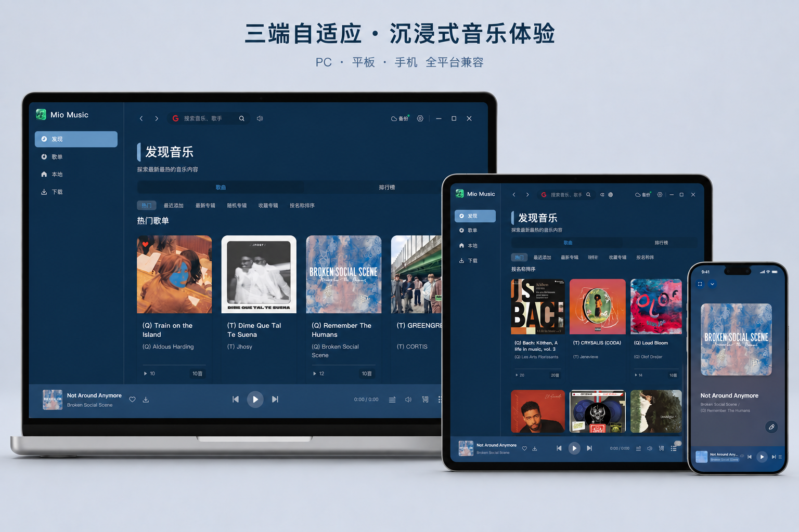

<p align="center">
  
</p>

<h1 align="center">Mio Music</h1>

<p align="center">A cross-platform desktop music player built with Tauri 2 + Vue 3</p>

<p align="center">
  <a href="README.md">中文</a>
</p>

---

## Introduction

Mio Music is a cross-platform desktop music player rebuilt from [CeruMusic](https://github.com/timeshiftsauce/CeruMusic), powered by **Tauri 2 (Rust)** on the backend and **Vue 3 + TypeScript** on the frontend. It uses a plugin-based architecture to access multiple music sources.

> This project does not directly host or transmit any music data. All content is fetched from third-party music sources via plugins. The legality of data obtained through plugins is the responsibility of plugin providers and users.

<p align="center">
  
</p>

## Features

### Music Playback

- Native Rust audio engine (Rodio + cpal) supporting AAC, MP3, FLAC, WAV, OGG, and more
- 10-band parametric equalizer with 8 built-in presets (Pop, Rock, Jazz, Classical, etc.)
- Bass boost, surround sound simulation (small/medium/large rooms), stereo balance control
- Gapless playback with configurable crossfade (default 3000ms)
- A/B dual audio output device comparison
- FFT spectrum real-time visualization
- System media key integration

### Lyrics System

- Multi-format parsing: LRC, YRC (NetEase word-by-word), QRC (QQ Music), TTML (Apple Music style), LRC-A2
- Lyrics translation merging
- Apple Music-style animated lyrics (@applemusic-like-lyrics)
- Standalone desktop lyrics window (transparent overlay)
- Custom lyrics font

### Music Sources

- Subsonic server support (self-hosted music)
- Plugin system: supports `LanYin` and `LuoXue` plugin types with dynamic install, configure, and test

### UI & Interaction

- Dynamic theme from album art (auto-extracts dominant colors, adapts to light/dark mode, generates 50+ CSS variables)
- PixiJS shader background rendering with audio-reactive spectrum
- Three.js particle animation welcome screen
- Virtual scrolling for long lists (@tanstack/vue-virtual)
- Custom title bar and window controls
- Right-click context menus
- AI assistant chat interface
- Global hotkey support

### Data Management

- Local music library scanning and audio tag editing (lofty)
- Download manager: pause/resume/cancel/retry/batch operations with real-time progress
- S3-compatible cloud backup and restore (AES-GCM encryption + password protection)
- DLNA casting: device discovery, play/pause/volume/seek control
- SQLite local database

### Additional

- Internationalization: Chinese / English (vue-i18n, 11 translation namespaces)
- Logto OAuth/OIDC user authentication
- Auto-update (GitHub Releases + Ed25519 signature verification)
- Route preloading and component lazy loading
- Album art CORS proxy (Rust backend imgproxy)

## Tech Stack

| Layer | Technology |
|-------|-----------|
| Frontend | Vue 3 + TypeScript |
| Build Tool | Vite 6 |
| State Management | Pinia 3 (persisted) |
| UI Libraries | TDesign Vue Next / Naive UI |
| Graphics | Three.js / PixiJS |
| Lyrics | @applemusic-like-lyrics |
| Backend | Tauri 2 (Rust) |
| Audio Engine | Rodio + cpal + Symphonia |
| Audio Processing | rustfft (FFT) + biquad (EQ) |
| Database | SQLite (rusqlite) |
| Styles | SCSS |

## Development

### Prerequisites

- [Node.js](https://nodejs.org/) >= 18
- [Rust](https://www.rust-lang.org/tools/install) (stable)
- [Tauri 2 prerequisites](https://v2.tauri.app/start/prerequisites/)

### Install & Run

```bash
# Install dependencies
npm install

# Start development mode (Vite + Tauri)
npm run tauri dev

# Build for production
npm run tauri build
```

### Other Commands

```bash
npm run dev        # Start Vite dev server only (port 1420)
npm run build      # Type check + Vite build
npm run preview    # Preview production build
```

### Recommended IDE

[VS Code](https://code.visualstudio.com/) + [Vue - Official](https://marketplace.visualstudio.com/items?itemName=Vue.volar) + [Tauri](https://marketplace.visualstudio.com/items?itemName=tauri-apps.tauri-vscode) + [rust-analyzer](https://marketplace.visualstudio.com/items?itemName=rust-lang.rust-analyzer)

## Project Structure

```
├── src/                          # Vue frontend
│   ├── main.ts                   # App entry (Pinia, i18n, Router, Logto init)
│   ├── router/                   # Route config (hash mode, with preloading)
│   ├── store/                    # Pinia stores (16 stores)
│   ├── views/                    # Page components (welcome, home, music, settings, etc.)
│   ├── components/               # Shared components (40+, player, settings, AI, etc.)
│   ├── composables/              # Vue composables (dynamic theme, background render, etc.)
│   ├── locales/                  # i18n translations (zh-CN / en-US)
│   ├── bridge/                   # Electron → Tauri IPC adapter layer
│   ├── services/                 # Service layer (musicSdk, etc.)
│   ├── utils/                    # Utilities (download, quality, proxy, plugin runner, etc.)
│   ├── types/                    # TypeScript type definitions
│   └── assets/                   # Static assets (CSS, fonts, icons)
├── src-tauri/                    # Rust backend
│   ├── src/
│   │   ├── player/               # Audio engine (playback, effects, spectrum, media control)
│   │   ├── music_sdk/            # Music source implementations (kw/kg/wy/tx/mg/bd/xm + Subsonic)
│   │   ├── plugin/               # Plugin manager and execution engine
│   │   ├── download/             # Download manager (pause/resume)
│   │   ├── local_music/          # Local music scanner and cover cache
│   │   ├── audio_device/         # macOS CoreAudio device management
│   │   ├── audio_capture/        # System audio capture
│   │   ├── commands/             # Tauri command handlers (config, hotkey, S3, etc.)
│   │   └── db/                   # SQLite databases (music library, playlists)
│   └── Cargo.toml
├── public/                       # Public static assets
├── scripts/                      # Build scripts
└── package.json
```

## Credits

- [CeruMusic](https://github.com/timeshiftsauce/CeruMusic) — Original project by **ShiQianJiang**
- [Tauri](https://tauri.app/) — Cross-platform desktop app framework
- [TDesign](https://tdesign.tencent.com/) — UI component library
- [Apple Music-like Lyrics](https://github.com/Steve-xmh/amll) — Lyrics component
- [LINUX DO](https://linux.do) — Community support
- [AutoEq](https://github.com/jaakkopasanen/AutoEq) — Auto equalizer preset data

## Support the Current Author

Ongoing maintenance, cross-platform adaptation, and issue fixes for Mio Music are contributed by the current project author. If this project helps you, you can support future development with the appreciation code below.

<p align="center">
  
</p>

> All donations are voluntary and go directly toward the current author's continued development and maintenance.

## Disclaimer

This project is for educational and personal use only. It does not directly fetch, store, or transmit any music data or copyrighted content — it only provides a plugin runtime framework. Use for any commercial purpose or infringement of third-party rights is prohibited.

## License

This project follows the open-source license of the original CeruMusic project.
